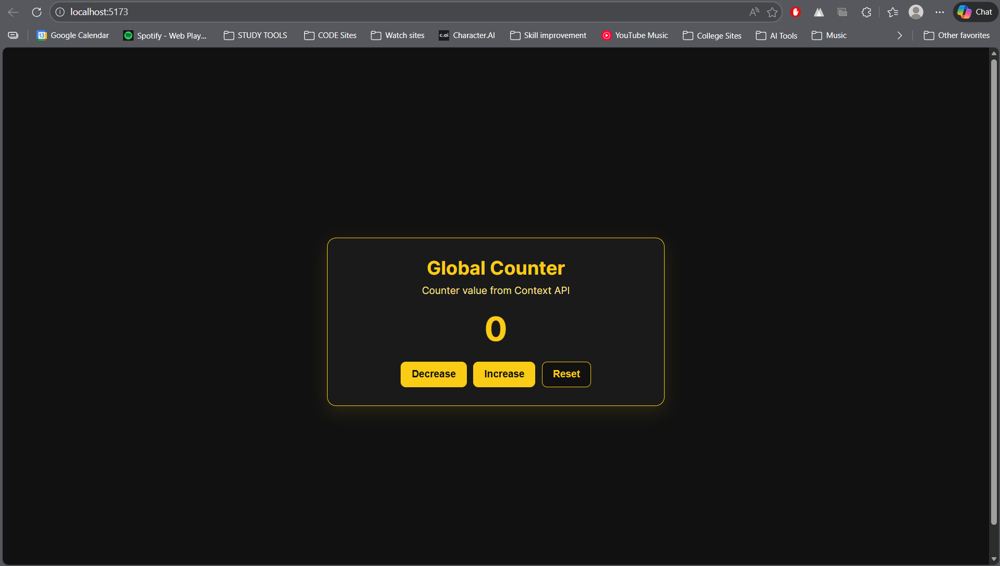

# Context API Counter Lab (EXP4.2)

This project is a simple React + Vite lab that demonstrates how to use the Context API
for global state management.

The app keeps a counter in global state and allows multiple actions on that shared value.

## Demo



## What This Project Covers

- Creating a global context using `createContext`
- Providing shared state from a top-level provider
- Accessing global state with a custom hook (`useGlobalContext`)
- Updating shared state from UI buttons
- Applying clean, static CSS styling without animation effects

## Features

- Global counter state (`count`) managed in context
- Dedicated actions: `increment`, `decrement`, and `reset`
- Minimal card-based UI for easy readability
- Yellow/black themed interface consistent with EXP4.1
- Beginner-friendly file structure

## Tech Stack

- React
- Vite
- CSS
- JavaScript (ES6+)

## Run Locally

```bash
npm install
npm run dev
```

After running the dev server, open the local URL shown in the terminal (usually `http://localhost:5173`).

## Project Structure

```text
src/
	context/
		GlobalContext.jsx   # Global provider + counter actions
	App.jsx               # Counter UI
	App.css               # App styling
	main.jsx              # Root render and provider wrapping
```

## Learning Outcome

By completing this exercise, you understand how to lift state into Context and manage
app-wide data cleanly without prop drilling.
