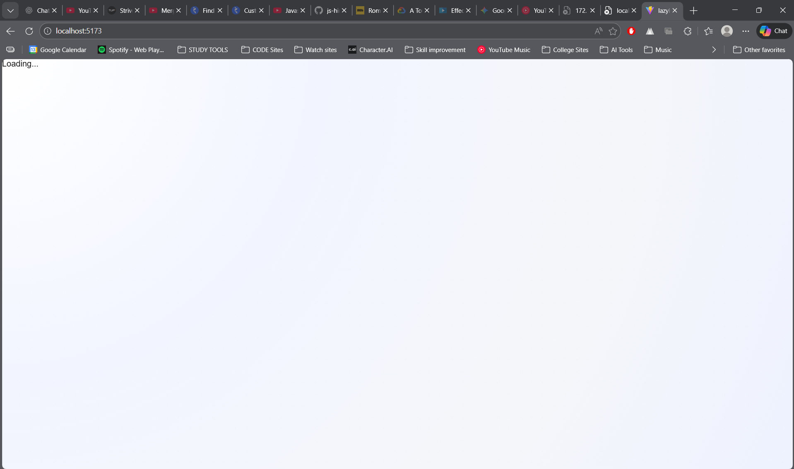
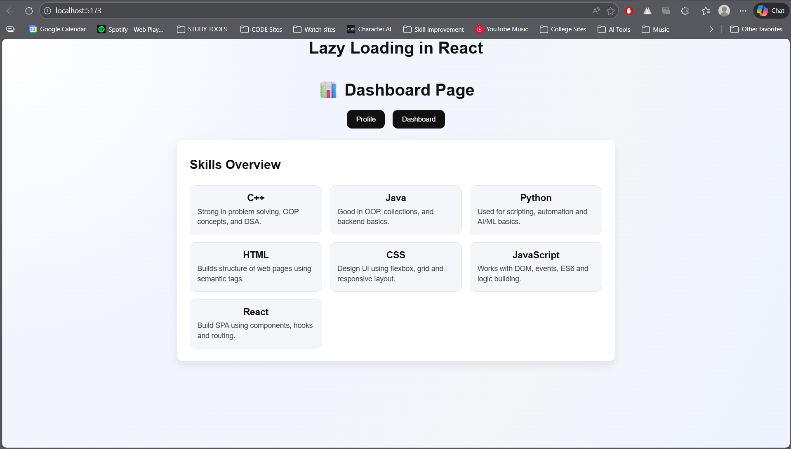

# Lazy Loading Demo (React + Vite)

This project is a simple demo that shows how lazy loading works in React using `React.lazy()` and `Suspense`.

## Demo




## What it shows

- Components load only when needed, reducing the initial bundle size.
- A fallback UI is displayed while the lazy component is being loaded.

## Run locally

```bash
npm install
npm run dev
```
