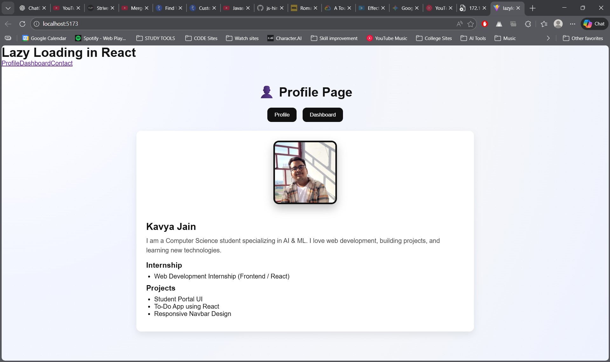
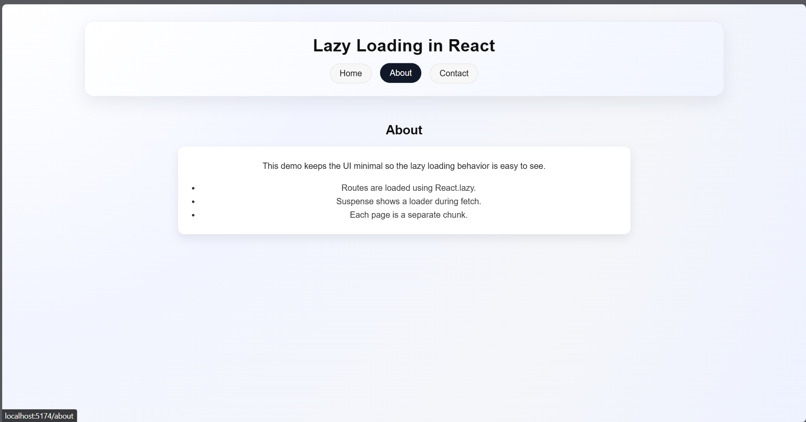

# Multi Lazy Loading (React + Vite)

This project demonstrates lazy loading for multiple components and routes in React using `React.lazy()` and `Suspense`.

## Demo





## What it shows

- Profile, Dashboard, and Contact are loaded on demand.
- A fallback UI appears while each module is fetched.

## Run locally

```bash
npm install
npm run dev
```
