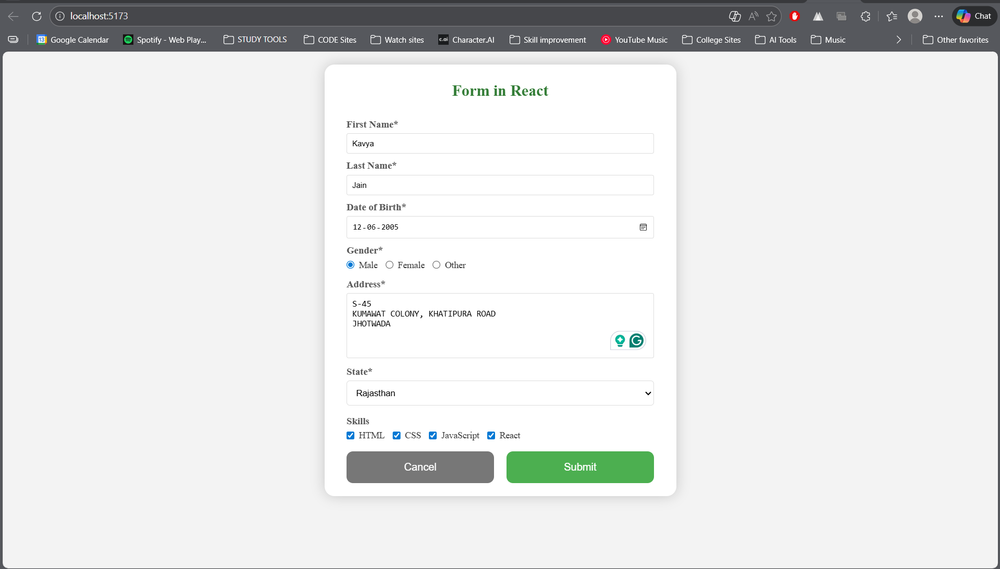
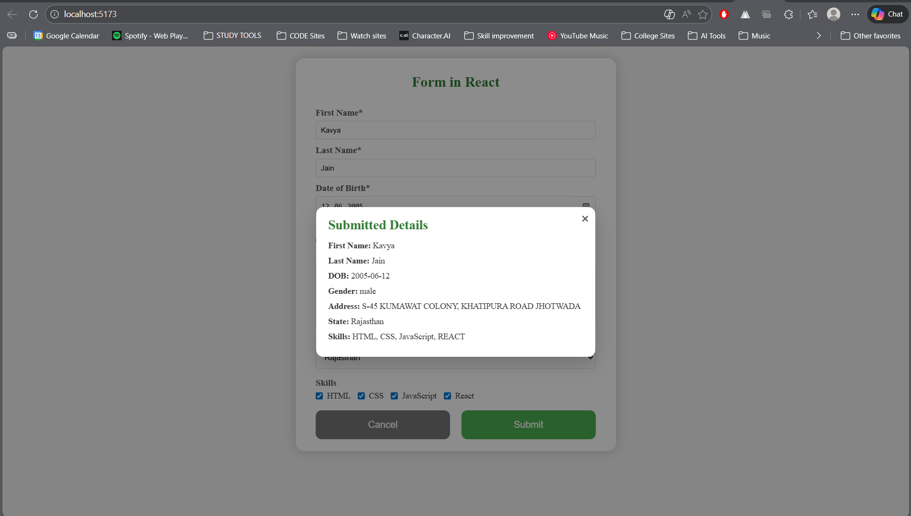

# Experiment-6.1: Handling Forms Using Controlled Components

## Aim

To create and handle forms in a frontend application using controlled components in React.

## Software Requirements

- Node.js
- React
- VS Code
- Web Browser

## Theory

Controlled components are React components in which form data is handled by the component's state. This provides complete control over user input.

## Procedure

1. Create a React application.
2. Create a form component.
3. Use `useState` to store input values.
4. Handle input change events.
5. Submit the form using an event handler.

## Demo

### Image 1

### Image 2

