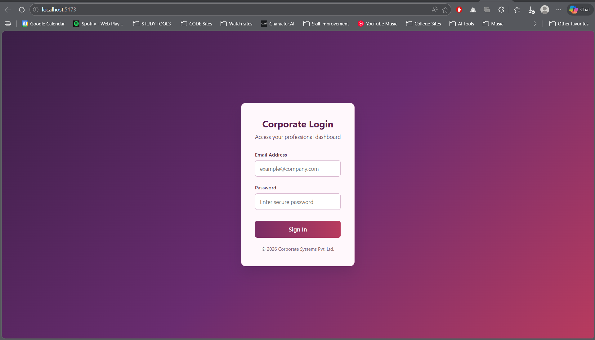
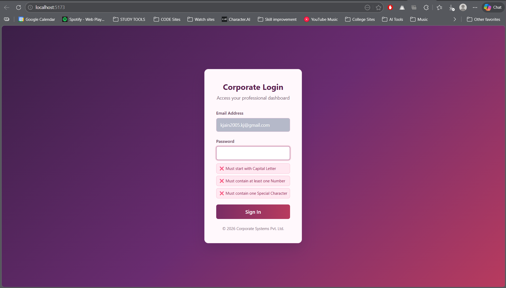

# Corporate Login Form

A dynamic and secure Corporate Login Form built using **React** and **Vite**. This project demonstrates essential front-end concepts such as controlled components, real-time input validation, regular expressions (Regex), and conditional rendering based on component state.

The UI now uses a refreshed **berry gradient theme** with improved input focus states and cleaner validation message styling.

## Screenshots




## Features

- **Email Validation:** Validates the email format using Regular Expressions to ensure users submit a valid address before submission.
- **Live Password Validation:** Provides real-time feedback as the user types their password. The password must meet several strict requirements:
  - Must start with a Capital Letter
  - Must contain at least one Number
  - Must contain at least one Special Character (`!@#$%^&*`)
  - Minimum 5 characters required
- **Conditional Rendering:** Upon successful validation and submission, the application seamlessly transitions from the login form to a success dashboard displaying a welcome message.
- **Modern UI:** Features a clean, corporate-style interface with a custom pink-purple color palette and subtle hover/focus effects.

## Technologies Used

- React (v19)
- Vite
- CSS (custom styling)

## Getting Started

Follow these steps to run the project locally.

### Prerequisites

Ensure you have [Node.js](https://nodejs.org/) installed on your machine.

### Installation

1. Navigate to the project directory:
   ```bash
   cd EXP6/EXP6.2
   ```
2. Install the dependencies:
   ```bash
   npm install
   ```

### Running the App

Start the development server:

```bash
npm run dev
```

The app will be available at `http://localhost:5173/` by default.

## Available Scripts

- `npm run dev` - Starts the Vite development server.
- `npm run build` - Builds the app for production.
- `npm run lint` - Runs ESLint to check for code quality.
- `npm run preview` - Previews the production build locally.
