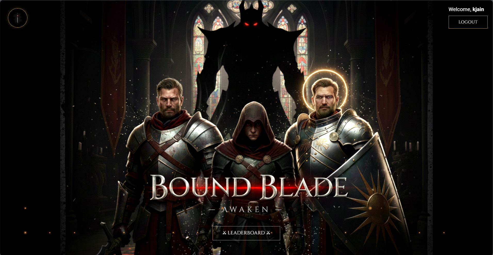

# Bladebound

An immersive medieval RPG game built with React. Engage in turn-based combat with stunning animations, atmospheric sound effects, and dynamic gameplay mechanics.



## Features

- **User Authentication** - Secure login/register with JWT tokens
- **Turn-Based Combat System** - Strategic battles with attack, defend, and special abilities
- **Character Selection** - Choose from different character classes
- **Dynamic Enemy AI** - Face challenging opponents with varied tactics
- **Screen Shake & Animations** - Framer Motion-powered combat effects
- **Atmospheric Audio** - Medieval RPG sound effects for immersive gameplay
- **Score Tracking** - Automatic battle score saving
- **Leaderboard System** - Compete with other players
- **Password Reset** - Forgot password recovery option

## Tech Stack

### Frontend

- **Framework**: React 19
- **Build Tool**: Vite 7
- **UI Library**: Material-UI (MUI)
- **Animation**: Framer Motion
- **Styling**: Bootstrap 5, Emotion (CSS-in-JS)
- **Linting**: ESLint

### Backend

- **Server**: Node.js + Express
- **Database**: MongoDB
- **Authentication**: JWT (JSON Web Tokens)
- **Password Hashing**: bcryptjs
- **API**: RESTful

## Getting Started

### Prerequisites

- Node.js (v16+)
- MongoDB (local or MongoDB Atlas)
- npm or yarn

### Installation & Running

#### Step 1: Install Frontend Dependencies

```bash
# Install frontend dependencies
npm install
```

#### Step 2: Install Backend Dependencies

```bash
# Navigate to backend folder
cd backend

# Install backend dependencies
npm install
```

#### Step 3: Setup MongoDB

**Option A: Local MongoDB**

- Install MongoDB Community Edition from [mongodb.com](https://www.mongodb.com/try/download/community)
- Start MongoDB service

**Option B: MongoDB Atlas (Cloud)**

- Create free account at [mongodb.com/cloud/atlas](https://www.mongodb.com/cloud/atlas)
- Create cluster and get connection string
- Update `backend/.env` with your connection string

#### Step 4: Configure Environment Variables

The `backend/.env` file is already created with defaults:

```env
MONGODB_URI=mongodb://localhost:27017/bladebound
JWT_SECRET=your_jwt_secret_key_change_this_in_production
PORT=5000
NODE_ENV=development
```

Update if using MongoDB Atlas or want to change the JWT secret.

#### Step 5: Run the Application

**Terminal 1 - Start Backend:**

```bash
cd backend
npm run dev
```

Backend will run on `http://localhost:5000`

**Terminal 2 - Start Frontend:**

```bash
# From root directory
npm run dev
```

Frontend will run on `http://localhost:5173`

#### Step 6: Play the Game!

1. Open browser to `http://localhost:5173`
2. Register a new account
3. Select your character class
4. Engage in battle!
5. View your scores on the leaderboard

## Project Structure

```
bladebound/
├── src/
│   ├── App.jsx          # Main game component with combat logic
│   ├── App.css          # Styling
│   ├── main.jsx         # React entry point
│   └── index.css        # Global styles
├── backend/
│   ├── server.js        # Express server
│   ├── package.json     # Backend dependencies
│   ├── .env             # Environment variables
│   ├── models/
│   │   ├── User.js      # User schema
│   │   └── Score.js     # Score schema
│   ├── routes/
│   │   ├── auth.js      # Authentication endpoints
│   │   └── score.js     # Scoring endpoints
│   └── middleware/
│       └── auth.js      # JWT verification
├── public/
│   ├── background/      # Battle backgrounds
│   ├── characters/      # Character sprites
│   ├── enemy/           # Enemy assets
│   ├── logo/            # Branding
│   └── videos/          # Cinematic clips
└── package.json         # Frontend dependencies
```

## Game Flow

1. **AUTHENTICATION** - Login or register
2. **START** - Main menu with leaderboard access
3. **PROLOGUE** - Story introduction
4. **CHARACTER** - Character class selection (Knight, Paladin, Rogue)
5. **COMBAT** - Turn-based battle system
6. **RESULT** - Victory/Defeat screen with score

## API Endpoints

### Authentication

- `POST /api/auth/register` - Create new account
- `POST /api/auth/login` - Login user
- `GET /api/auth/me` - Get current user
- `POST /api/auth/reset-password` - Reset password

### Scoring

- `POST /api/score/save` - Save battle score (requires auth)
- `GET /api/score/user` - Get user's scores (requires auth)
- `GET /api/score/leaderboard` - Get top 10 players

## Troubleshooting

**Backend won't start:**

- Ensure MongoDB is running
- Check connection string in `.env`
- Verify port 5000 is not in use

**Frontend can't connect to backend:**

- Make sure backend is running on port 5000
- Check API_URL in `src/App.jsx`

**Authentication issues:**

- Clear browser localStorage
- Re-register account
- Check JWT_SECRET in `.env`

## Production Deployment

For production, consider:

- Change JWT_SECRET to a strong random string
- Use MongoDB Atlas for cloud database
- Deploy backend to Render/Railway/Fly.io
- Deploy frontend to Vercel/Netlify

See `backend/SETUP.md` for detailed deployment instructions.

## Credits

**Developer**: Kavya Jain  
**Role**: AI ML Student

## License

Open source - available for modification and distribution.
